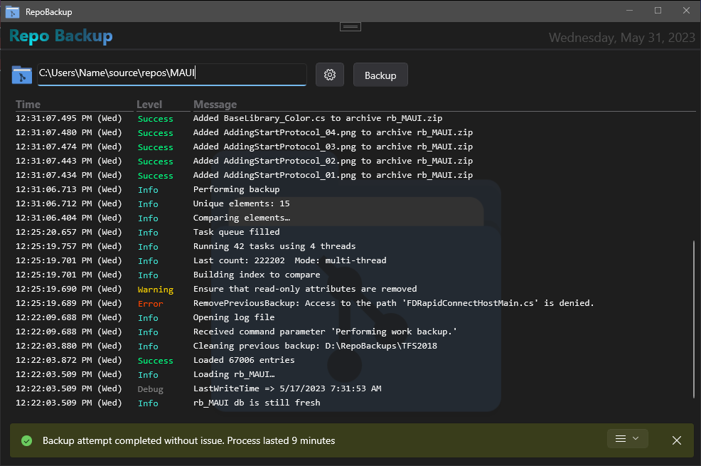
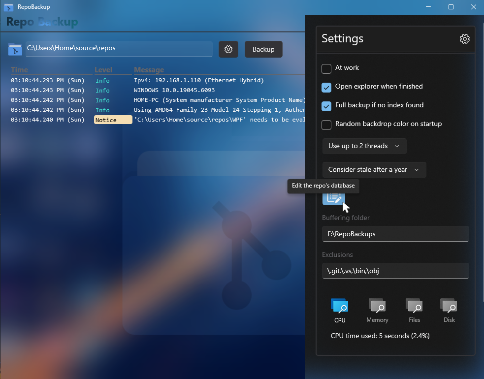

## 💻 Repository Backup Utility

* Zips up your source code files into a single archive which contains only the files that have been changed since the last analysis. This archive will not include binary files located under the `/bin` and `/obj` folders. This filter may be expanded upon in the ignore list. 
* This project began as a simple source code backup/sync utility and grew into a more complex demonstration of other **WinUI** features.
* One of the main goals during the writing of this application was to not use any 3rd party libraries; so you'll find classes such as `RelayCommand`, `ObservableObject`, et. al. I maintain a large collection of solutions at work and one of my pet peeves is the "ghosting" of some **NuGets** as they age. There have been many times during development on a large system where a **NuGet** that the application base was designed with is no longer supported or updated, causing the entire project to need revamping. (c'est la vie for programmers)
* You will find that some of the contents have no practical purpose, e.g. the `AcrylicRectangle` on the `SplitView` settings panel, but it is more for UX to show how one might accomplish the effect if it was required.
* I highly recommend keeping this project in an **Unpackaged** format, as it was meant to be a portable utility.
* I've included an exhaustive collection of helpers that one can use in any WinUI project, such as the `NativeMethods`, `VisualTreeHelperExtensions`, `DispatcherQueueExtensions`, `Extensions` and `ModalView` libraries.
* I also tried to add extensive comments and notes to explain any caveats or idiosyncrasies with the **WinUI3** framework. If you have ever worked with **UWP** then you know that there can be major annoyances between **UWP** and **WinUI3**. Most of these issues arise from the `namespace` changes that *Microsoft* made, others are related to **Packaged** vs. **Unpackaged** apps. You can find a similar issue in the `App.xaml.cs` module concerning parsing of the `Microsoft.UI.Xaml.LaunchActivatedEventArgs` to which I provide a workaround. 
* One thing I've never seen on *Github* is any `csproj` that breaks down what the directive tags do, so if you open the `csproj` file you will find an extensive collection of what each tag does. I have setup the defaults to be the best configuration for an existing user who is coming from an older *VisualStudio* platform.
* Most of this code is my own doing, but you will find some code borrowed from other *Microsoft* repos, such as the `VisualTreeHelperExtensions`. When using other code snippets I have included links to their origin, or if it's a workaround you will find a the link to the relevant *Github* issue. If you have any questions or concerns, feel free to reach out to me in the issue/discussion threads.

## 📝 v1.0.0.12 - July 2023
* Added acrylic desktop support.

## 🧾 License/Warranty
* Permission is hereby granted, free of charge, to any person obtaining a copy of this software and associated documentation files (the "Software"), to deal in the Software without restriction, including without limitation the rights to use, copy, modify, merge, publish and distribute copies of the Software, and to permit persons to whom the Software is furnished to do so, subject to the following conditions: The above copyright notice and this permission notice shall be included in all copies or substantial portions of the Software.
* The software is provided "as is", without warranty of any kind, express or implied, including but not limited to the warranties of merchantability, fitness for a particular purpose and noninfringement. In no event shall the author or copyright holder be liable for any claim, damages or other liability, whether in an action of contract, tort or otherwise, arising from, out of or in connection with the software or the use or other dealings in the software.
* Copyright © 2022–2023. All rights reserved.

## 📋 Proofing
* This application was compiled and tested using *VisualStudio* 2019/2022 on *Windows 10* versions **22H2**, **21H2** and **21H1**.
* I have done my best to include version specific checks in the application when warranted, however bugs may be found when using this on OS versions outside of the aforementioned versions.
* Superfluous tests can be found in the `MainWindow.xaml.cs` secondary constructor.